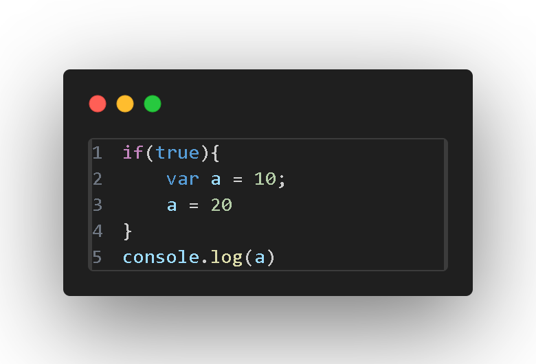
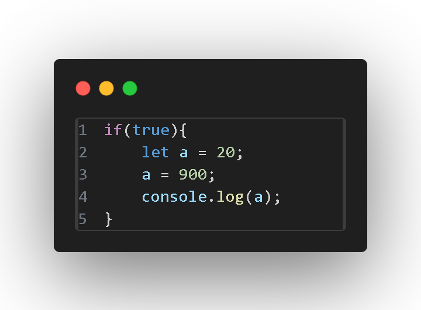
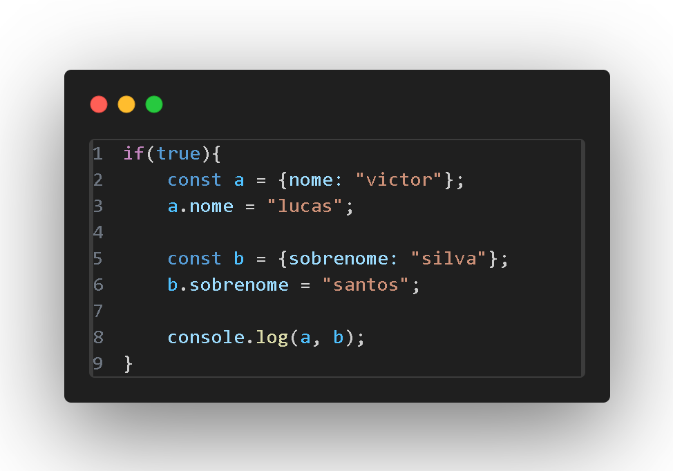

# Declaração de variáveis (relatório 31/12/24)

| Características   | Var   | Let   | Const |
|:------------|:------------|:------------|:-------------|
| **Escopo**  | *Função ou global* | *bloco*  | *bloco* |
| **hoisting**    | *Declarada, valor undefined*  | *Zona Temporal Morta*  | *Zona Temporal Morta* |
| **Redeclaração**  | *Permitida no mesmo escopo*  |  *Não permitida no mesmo escopo* | *Não permitida no mesmo escopo* |
| **Reatribuição**  | *Permitida*  | *Permitida*  | *Não Permitida* |
| **Imutabilidade** | *Não* | *Não* | *Sim (valor primitivo)* |
| **Uso típico** | *Código antigo ou legado* | *Variáveis que mudam de valor* | *Constantes ou valores imutáveis* |

# Exemplo em Código
 

  
  

